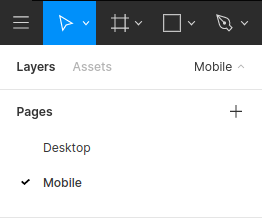
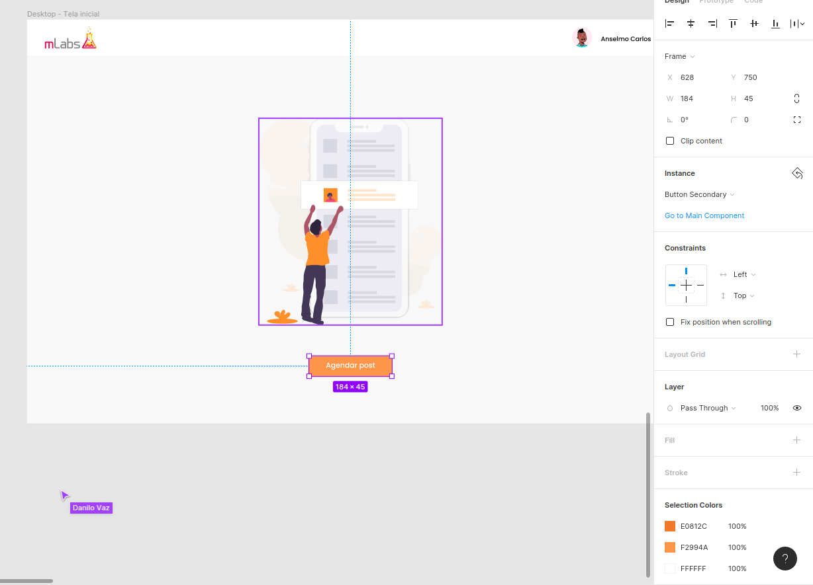
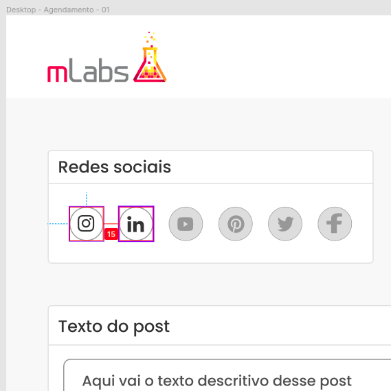
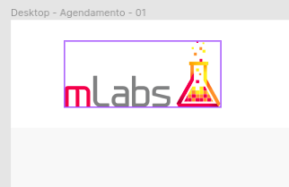
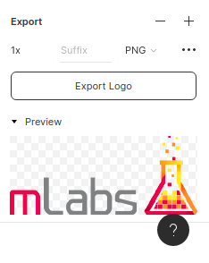
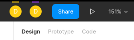
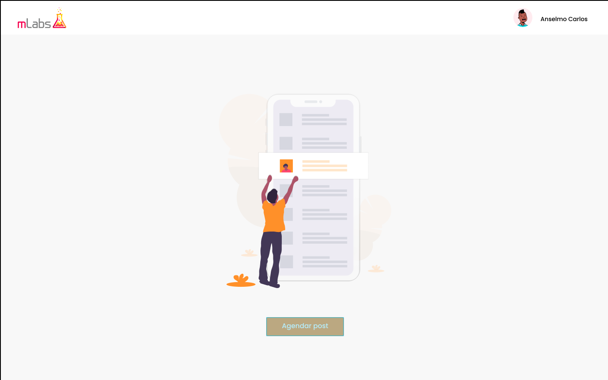
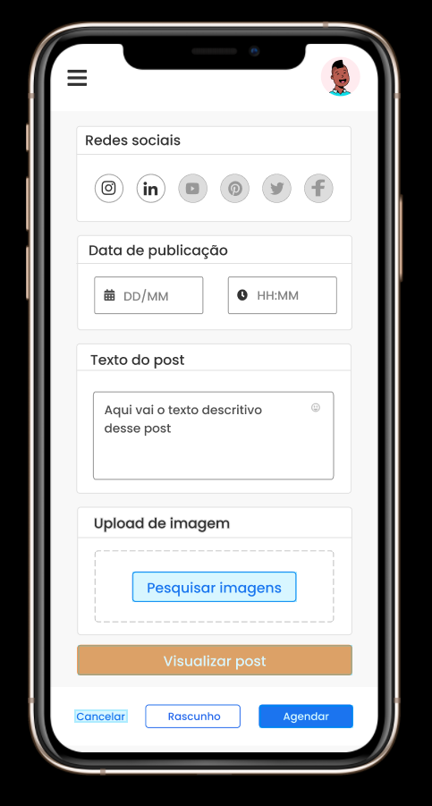

# Como usar o Figma

Esse é um guia básico para te auxiliar no uso do Figma, é bem simples e direto.

## Acessando

O Figma disponibiliza uma versão web, ou seja, através de seu browser você consegue usá-lo sem a necessidade de instalar nada.

Caso queira instalar o Figma em seu computador, siga [esses passos]() da documentação oficial: https://www.figma.com/downloads/

As interfaces do teste Front-End da mLabs encontram-se [nesse link](https://www.figma.com/file/JYNYnwyXKa0N3m7myjF8Y4/v1?node-id=0%3A1) e para que você poss usar os recursos completos da ferramenta, faça um cadastro/login no Figma bem rápido e prático.

## Navegando entre os protótipos Desktop e Mobile

Nós disponibilizamos para o teste tanto a interface Desktop quanto a Mobile. Para navegar entre elas, basta se orientar pelo menu no canto esquerdo da tela e clicar nas páginas Desktop ou Mobile:

## Buscando definições de cores e tamanhos

Basta clicar nos elementos da interface para ter acesso a informações das cores e tamanhos definidos nesse objeto e então copiar seu valor e usar em seu teste.

## Buscando definições espaçamentos

Com o Figma também é possível descobrir as margins e paddings dos objetos. Para isso, basta pressionar a tecla **ALT** e posicionar o cursor entre o elemento e o espaço que deseja saber.

## Exportando assets

Todos os vetores, imagens ícones na interface podem ser exportados.

Para isso, você primeiro deve selecionar a camada desse elemento que você quer exportar:

E então no seu canto direito clicar na opção **Export** onde é possível ter um preview de como ficará essa exportação, além de poder decidir se quer um PNG, JPG ou SVG e até se quer em 1x ou 2x a qualidade:

## Rodando o protótipo navegável

O Figma também nos permite ter esse protótipo de forma navegável, para que você possa entender o fluxo da interações e páginas.

Para rodar, basta ir no seu canto superior direito e clicar no ícone de play. Se você estiver na página de Desktop, vai rodar o protótipo de Desktop, se estiver na página de Mobile, vai rodar o protótipo de Mobile:

Após isso, navegue pela página como se estivesse no site realmente. Uma dica para saber quais locais tem interações no protótipo, clique duas vezes na tela e alguns locais ficarão com o fundo azul rapidamente, esses locais possuem interações no protótipo, basta interagir com eles:

## Dicas

- Você pode selecionar as camadas navegando pelo menu esquerdo, onde ficam as camadas e entrando em cada nível, ou você pode ir dando duplos cliques na interface, diretamente no objeto que você quer chegar para que o Figma vá adentrando nesse item.
- Tanto o Scroll quanto o Trackpad servem apenas para navegar no documento, para dar zoom pressione a tecla **CTRL** e role o Scroll ou Trackpad.